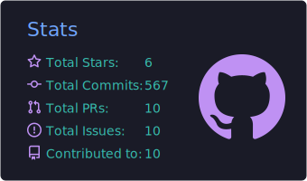
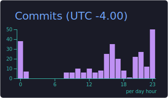
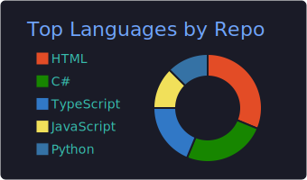
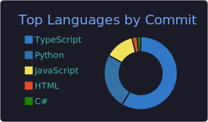

  

---

### **Contacto**  

  
  &nbsp;&nbsp;&nbsp;&nbsp;
  
  &nbsp;&nbsp;&nbsp;&nbsp;
  
  &nbsp;&nbsp;&nbsp;&nbsp;
  

---

<h2>Stack Tecnológico </h2>

| **Backend** | **Frontend** | **Herramientas** |
| :---: | :---: | :---: |
|    |  |    |

 
<h3 align="center">Inteligencia Artificial</h3>

  <table>
    <tr>
      <td align="center" width="140">
         
        
          
        <b>Agents</b>
         
      </td>
      <td align="center" width="140">
         
        
          
        <b>AI Skills</b>
         
      </td>
      <td align="center" width="140">
         
        
          
        <b>MCP</b>
         
      </td>
    </tr>
  </table>

---

## ⚙️ GitHub Analytics

  

  
  

  
  

