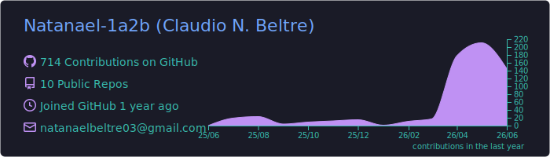

  

---

### 🔗 **Conéctate conmigo**  

  
  &nbsp;&nbsp;&nbsp;&nbsp;
  
  &nbsp;&nbsp;&nbsp;&nbsp;
  
  &nbsp;&nbsp;&nbsp;&nbsp;
  

---

<h2>🚀 Stack que domino </h2>

| ⚙️ **Backend** | 🎨 **Frontend** | 🛠️ **Herramientas** |
| :---: | :---: | :---: |
|    |  |    |

---

## ⚙️ GitHub Analytics

  

  
  

  
  

  

